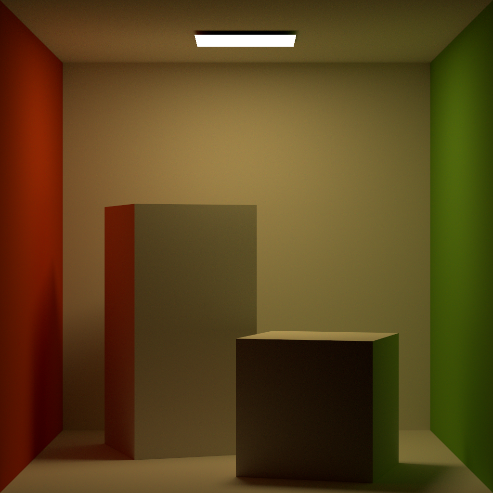

# Bonsai RT

A fairly simple spectral renderer using vulkan ray acceleration.
Supports diffuse, dieletric and conductive materials.

## Example scene
### Cornell Box
[Cornell Box Scene](scenes/cornell_box.json)

## Scene Format
### Settings
- internal_color_mode - determines how color are respresend internally "xyz_d65" or "approx_xyz_d65"
- integrator - "nne"
- max_depth - determines how many times light rays bounch in the scene per sample
- n_samples - determines the number of samples per pixel
- width - width of the output image
- height - height of the output image
### Camera
- type - "pinhole"
- position - postion of the center of the camera
- direction - the direction the camera is faceing
- up - the direction that is considered up in the scene
- size - the fov of the camera
### Objects
An array of objects in the scene fields are
- material_name - the name of the material used to shader this object must match a material in the materials array
- obj_file - relative path of the object file
- transform - a 4 by 4 matrix representing the transform applied to the object to take it from objt space to world space
### Materials
An array of materials used by objects and lights fields are
- material_name - the name of the material used to reference it in lights and objects arrays
- type - "diffuse", "conductive", "dielectric", "emmisive"
- color - linear rgb color of the material
- ior - index of refraction of the material
- ec - extinction coefficient of the material
### lights
An array of lights in the scene fields are
- type - "object"
- material_name - the name of the material used to shader this light must match a material in the materials array
- obj_file - relative path of the object file
- transform - a 4 by 4 matrix representing the transform applied to the light to take it from objt space to world space
